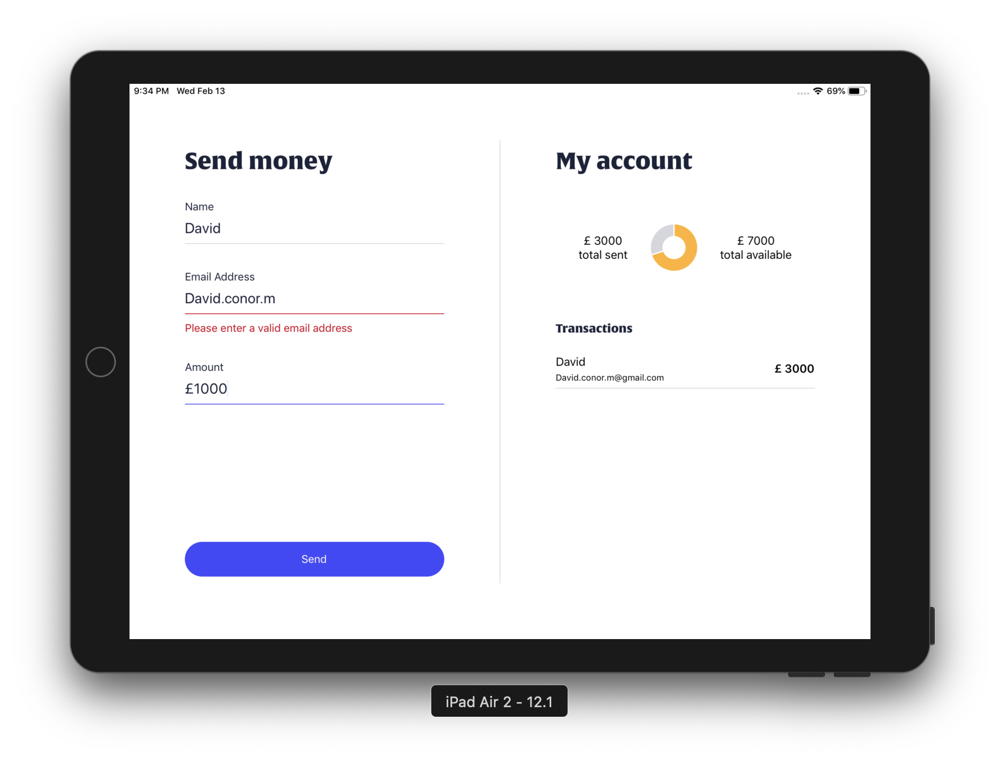

Money Sender
==========================



A simple application that displays a form and allows the user to submit transactions to be removed from their account.

To run the app install the dependancies and run the app, you can do this through npm with:

```
npm install
npm run start:ios
```

you can run the test suite through:

```
npm run test
```

## What did you use and why?

The application was built using Typescript as much as possible to ensure type safety at compile time.

Redux was used but it could of been accomplished easy using the context api.

Redux-Observable was used as a middleware, this allows us to potentially add in async network requests in the future but it also comes with many convenience operators like delay, which was used to fake a response time from the server.


## What improvements can i make?

Could of added layout support for iphone, i feel the UI is pretty flexible and wouldnt of required too much more time.

The jest tests are working but run twice over both the js and ts files, wasnt able to track this issue down in the remaining time i had.

